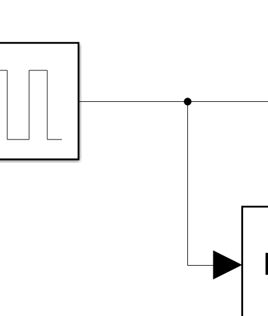
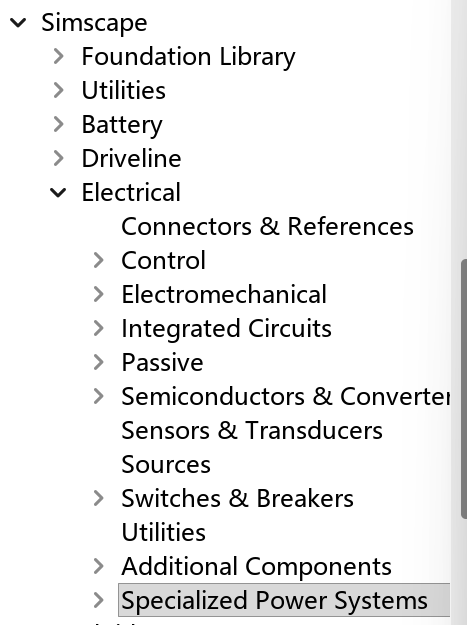
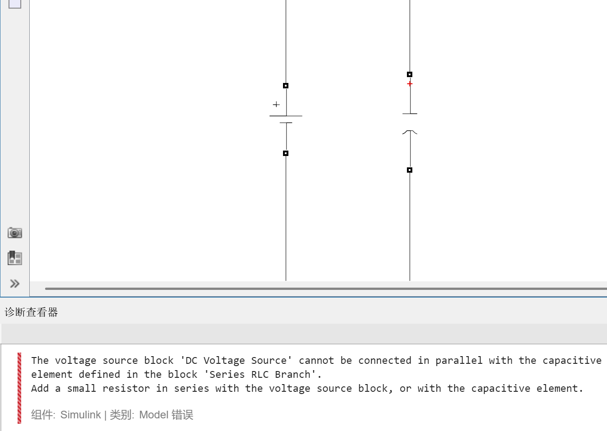
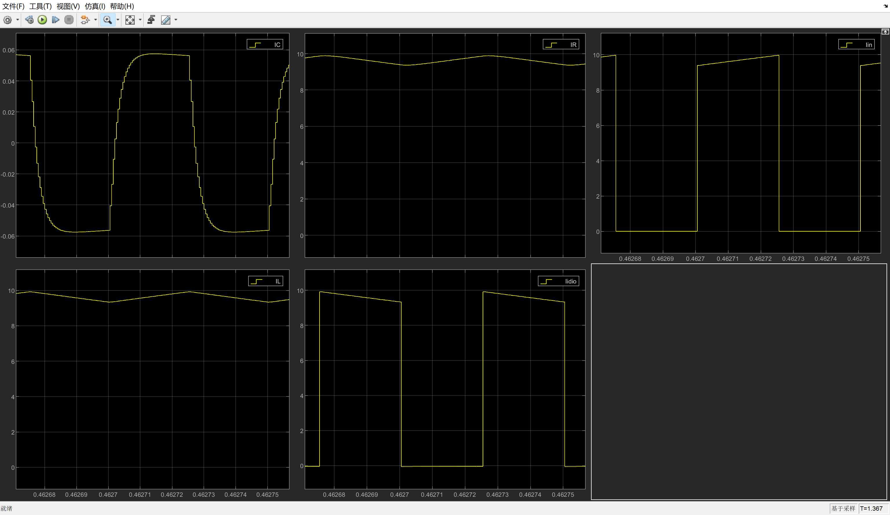
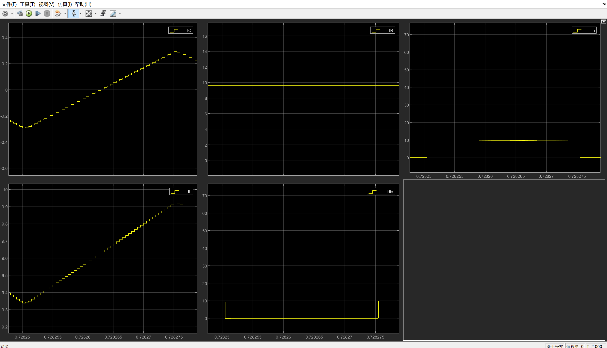
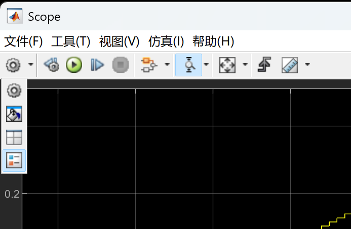
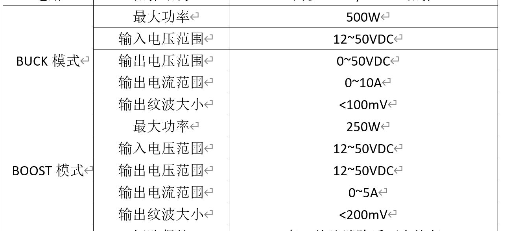

> 关注
>
> 1. 电力电子拓扑的工作原理
> 2. 硬件电路的基本结构（模块功能）
> 3. **控制策略**：这个项目用了什么控制算法，为什么选择这个算法、控制参数如何计算和整定
> 4. **建模过程**：如何对系统进行数学建模、控制系统建模、仿真验证
> 5. **算法实现**：控制算法如何转化为DSP代码
> 6. **调试问题**：软硬件联调时如何观察和调整

# 2.1 BUCK理论基础

1. 电感的激励是电压。电容的激励是电流。稳态储能元件周期初始值=终值。因此，激励的周期净值应该为0。

   电感伏秒平衡、电容安秒平衡

   $i_L(T_s) - i_L(0) = \frac{1}{L} \int_0^{T_s} v_L(t) dt$

   $0= \int_0^{T_s} v_L(t) dt$

   $v_C(T_s) - v_C(0) = \frac{1}{C} \int_0^{T_s} i_C(t) dt$

   $0= \int_0^{T_s} i_c(t) dt$

​	水龙头是激励，是变化率。水桶（电感电流、电容电压）是对应的值。电感大，相当于水桶大，相同的激励下，变化斜率越小：uL=Ldi/dt.

2. 电力电子电路的稳态指周期性重复的稳定运行状态而不是绝对不变的稳态。

3. **DCDC稳态分析方法：**

   1. 根据电路中【开关的象限与控制方法】，做出不同的电路模态，标出电感电容的电流电压参考方向

      > 注意：**DCDC电路的本质内核应该是不同的电路模态**，开关器件与其对应匹配的控制方法设计并不唯一，能实现模态切换就行！
      >
      > **buck与boost不是一拍脑袋就出来的拓扑，而是计算出来的，有设计方法的，由仿真验证**
      >
      > 搞明白要设计的电路不同的状态（包含不同路的通与断）->对应支路根据模态分析这些开关的运行象限->确定开关（单个或者多开关器件复合而成）
      > 多象限向低象限兼容

   2. 找出电路中不同模态电感电容的激励表达式

   3. 【第一次小纹波近似】使用iL与uC的平均值来代替**（现实是不合适的，因为拓扑变换，根据电路理论，会有充放电的过程）**

      > 先小纹波，才能出积分里面提出来，成为常数×时间

   4. 伏秒平衡、安秒平衡，得到两个平衡方程：< vL >=...=0、< ic >=...=0

   5. 分析求解（1）M(D)（2）直流分量

   6. 带入2的激励表达式，【第二次小纹波近似】，得到激励大小

   7. 画出储能元件上激励波形→电感电流与电容电压波形→做出开关器件波形**（根据此步可以进一步计算纹波，辅助器件选型）**

   **局限性：这种稳态分析方法分析出来结果（波形，电感电容计算公式）比较粗略，二阶滤波器等结构还需要进一步分析。**

4. 同步buck与普通buck有什么区别

   普通BUCK：

   使用**二极管**（D1）作为续流元件。当主MOS管Q1关断时，电感电流通过二极管D1续流。

   **缺点**：二极管导通时具有较大的管压降，会造成较大的导通损耗。

   同步BUCK：

   > 同步 = 与主MOS管的开关动作"同步配合"

   使用**MOS管**（Q2）代替续流二极管，并控制Q2的导通模式与原来续流二极管的导通模式相同（即Q1开通时Q2关断，Q1关断时Q2开通，两者互补工作）。

   **优点**：**MOS的导通内阻较低，相比二极管能显著降低导通损耗，提高变换器效率。**

# 2.2 2.3 2.4 2.5 2.6 buckboost 开环 simulink仿真

- 之一使用simulik先保存。因为是和matlab后台联动的，所以需要开新的工作区域

- 元件箭头只能连一个，要连其他的就得接到线路上：

  

- 电力电子仿真：电气专用库+simulink库



- 发出的信号可以直接连接到scope

- 同一个器件，但是可能有多种，注意选择同一个库的模型，不同库的模型不能被连接

- 二极管与mos的m有什么用？

- 电容正负有区别吗——有的

- 常用组件：

  - 电流表模块：Current Measurement
  - 信号组接器：bus creater（可以将两个信号合并，使得在一个scope窗口中可以显示两个信号）
  - 数据类型转换器：Data Type Conversion
  - PowerGUI是电气专用库的核心求解器，通常使用离散模式（对于电源来说，高频，使用离散模式可以自定义步长，让步长设定的更短）：周期选择：$1/f_{\text {pwm}}/100$指的是1个周期中计算100个点

- 技巧：
  - 尽量拓扑器件距离拉大，不然后期放测量器件放不下
  - goto from蓝色箭头向外托就是另一个
  - 连接在出现蓝色箭头后点击

- 问题：直流电源并联电容，电容最初的电压为0，所以DC被短路，因此要串小电阻

  

- C是隔离直流通交流，但是R是直流交流都通，所以不能说是把直流分量全分给R，其他的都给L。应该是直流都给R，交流随后R与C再分配，R呈现的是直流分量与部分交流分量的和分量。

- 把C增大，会比较明显，近似于将直流全给了R，交流全给了C**（这就是电容的滤波效益，也就是说，当并联电容越大，信号中的交流分量就越可以被C滤除了）**：

  

- 显示图示

# 3 硬件计算

1. 明确主控器件，因为占空比是针对主控器件的占空比进行描述的

2. 
   - 输入都是最低12V：小于12V欠压保护，不开启工作
   - buck输出电压范围：0-50V，0对应D为0，50V对应，输入50，D取1。
   - boost输出电压范围：12-50V，12V对应输入12V，D=0(D'=1)。50V对应，输入50，D取0（boost输出电压一定被输入电压要大，见输入输出表达式，因此最小12V）
   - 最高电压电压是由电路整体的耐压上限决定的 

3. 额定值指经常运行的状态的值，被人为定义的

4. 以buck为例，输出电流的波形是电感与电容的共同作用结果：电感越大，对应电感电流的纹波斜率就越小，越平滑，电容就可以取的低一点。如果电感小，电容就要取大一点。因此硬件计算没有一个很固定的计算方法

5. 可以在仿真中看出，器件大小影响输出电压的质量（纹波大小），但是都是可以正常工作的。纹波越小，要求电感电容都越大，经济性变差，因此要往往考虑到经济效益+输出质量的折中。

6. 对于buck、boost硬件选型都有很成熟的选型计算公式，直接使用就行，不用直接推**（如果需要能看懂就行）**

7. 对于使用现成公式计算的，可以使用mathcad——构建计算数，只要修改最初的参数定义就能整体自动计算参数

8. 关于电感与变压器的一些特性：

   1. 电感感值越大，一般对应的内阻就越大，损耗就越大；
   2. 电感的公式：$L=\frac {μAn^2}{l}$，一般电感和变压器为了增加电感值都有磁芯（μ增大）。由于磁滞回线，当电流增大，H增大，B随H呈μ的斜率增大。但到一定值时，H增大，μ会变小，并且变小的很快，此时L就会剧烈的变小，相同电压激励的情况下，电感电流变化率很变的很大（相当于水流不变，水桶变小），产生很高的电流峰值，使得开关器件等元件被击穿。**（电流值增大对电感的衰减作用）**

9. 硬件参数计算思路：
   1. 分别分析buck与boost电路的器件选择：

      1. **确定设计指标：**

         获取额定输入输出电压（对应额定占空比），额定负载（决定额定输出电流）

         > 额定值是被人为定义的（通常是工作时间最长的输入输出工作点）

      2. **确定储能元件大小：**

         1. 确定**电感电流最大纹波**与**输出电压最大纹波**
         2. 确定理想电感与理想电容的值（有公式，带入额定工作点，DCDC稳态分析给出的公式是一种）
   
      3. **运行状态计算：**搭建模型，得到**理想电路**中各个元件的电流电压波形，求各个元件的电流电压波形的峰值/均方根值（有效值）
   
         > 通过仿真or电路理论分模态纯数学推导，一般采用仿真手段
   
      4. **器件选型：**
   
         1. 电感：求解出的理想电感值作为参考量。
   
            考虑实际：
   
            ①内阻
   
            ②磁饱和
   
            > 一般电感值越大，对应内阻越大，相同电流发热越严重；磁饱和导致电感值随电流增大的衰退效应。
   
            一般选择器件要比初步确定的器件大小要大一点。一方面留有余量，另外一方面有较高抗饱和能力。 
   
         2. 电容：求解出的理想电感值作为参考量。
   
            考虑实际：
   
            ①串联内阻ESR（必须考虑，往往输出纹波值比计算值大就是因为有ESR作用）
   
            电容的选择是一个很经验的过程，一般要通过实验测定选择是否合适。
   
         3. mos：
   
            ①耐电流能力（2倍最大电流）
   
            ②耐压能力（最大电压1.5倍，不工作时承受输入电压，此处带入最大输入电压）
   
            ③耐高温
   
            注意：mos与实际情况关系比较大，温度与实际散热设计有关，耐压与关断时的尖峰电压有关，与布线有关
   
   2. 对元件选择进行对比取折中 
   
10. boost分析也有类似二阶滤波器的情况：	

    因此在此模态实际上ic的波形不是平平的：	

    实际上，是此时iL的模型分配给C与R，如果C足够大，那就是只把纹波分配给C，把直流分配给R,如下：

    

    

    

    在另外一部分是电容接电阻，0输入响应。呈现指数衰减，所以是绝对值逐渐变小的。

    **遗留的工作：带入文七计算出来的参数，去仔细分析一下buck、boost的实际波形是怎么样的，会不会出现上面的情况，结合电路知识，增强对拓扑的认识**

# 4. 开发板原理图

1. 电感在的那一侧是低压侧（电流是续流的）

## 4.1 主功率板：

1. 主电路
2. 驱动电路
3. 调理电路
4. 辅助电源

### 4.1.1 主电路

关于实际电路板的额外设计：

1. **保护部分：**以保护元件烧坏以避免关键器件烧坏

   1. 保险丝：在两端，防止过压与过流

   2. D1和D2两颗二极管：设计在X端和Y端入口处，起**防反接保护**作用，保护电容以及mos管

      > ①防止电容两端电压被反接：电容的是靠氧化介质层工作的，正向偏置电压会维持甚至修复氧化膜，反接发生还原反应，使得介质层变薄溶解，从而被击穿；
      >
      > ②mosfet：存在寄生二极管使得反接直接导通主电路二极管，反接会烧坏管子
      >
      > 

2. **电流采样电阻：**

   R4 (0.001Ω): X端电流的取样电阻，用于检测X端输入/输出电流

   R3 (0.001Ω): 电感电流的取样电阻，用于检测电感电流

   R5 (0.001Ω): Y端电流的取样电阻

   作用：**电流采样电阻**（0.001Ω / 1% / 2512封装），用于将电流信号转换为电压信号，供控制器进行检测和闭环控制。

3. **端口CNT3/CNT4：**可以替代为导线，使用霍尔电流表来测量电感电流（调试使用）

4. **G与S之间的钳位电阻：**

   **需求一：驱动信号丢失时，确保MOS可靠关断。** 栅极高阻抗悬空时，微小的干扰电荷就能把Vgs抬起来造成误导通，所以需要一个电阻把栅极电位钳在源极电位上，保证没有驱动时，Vgs为0。避免两个驱动管同时误导通导致电源短路。

   **需求二：正常PWM驱动时，不干扰驱动信号。**  

### 4.1.2 驱动电路

- 为什么stm32产生的PWM波不能直接连接到栅极？

  MOS管的开通本质上是一个**对栅极电容充电**的过程。栅极等效为一个电容（Cgs + Cgd），驱动电路需要向这个电容灌入电荷，把Vgs从0V充到足够高（比如10-12V），MOS才能完全导通。stm32的驱动能力很差（提供灌电流的能力只有10mA，属于信号级别，不是功率级别）， 要为A级别才能保证mos管的开通速度。

- 驱动对mos管导通关断本质上是对Cgs充电放电的过程，充放电越快，导通关断越快

- 驱动电路的核心作用是**在控制信号（单片机PWM，3.3V弱电）和功率MOS（需要大电流驱动）之间做桥梁**，具体体现在：

  **1. 电平转换** 单片机输出的PWM是3.3V逻辑电平，而MOS的栅极需要12V才能完全导通（降低导通内阻），驱动芯片SI8233BD负责把3.3V信号转成12V驱动信号。

  **2. 提供瞬间大电流（快通快关，你说的这点）** MOS的栅极等效为一个电容，要让它快速充放电就需要瞬间大电流。单片机IO口电流能力很弱（几毫安），根本带不动。SI8233BD有4A的驱动电流能力，能快速给栅极电容充放电，从而实现快速开通和关断，降低开关损耗。

  **3. 隔离（这个项目特有的重点）** SI8233BD是隔离型驱动芯片，耐压4000V，将功率级和控制级电气隔离开来，防止功率电路的高压高频噪声直接冲击单片机，保护控制电路。

  **4. 死区控制，防止直通** 上管Q1和下管Q2绝对不能同时导通，否则电源直接短路。SI8233BD的DT引脚可以设置死区时间，保证两路驱动信号之间有足够的间隔，这是安全性保障。

  所以驱动电路 = 电平转换 + 增强驱动能力（快通快关）+ 隔离保护 + 死区防直通

### 4.1.3 调理电路

- 采样的信号：

  - 输出电压电流控制：buck：Y端电流电压；boost：X端电流电压
  - 电感电流控制：电感电流
  - 两颗mos管的温度：散热器温度
  - 电压旋钮电流旋钮输出采集

- 准确的将采样的物理量准确的转化为0-3.3V可供ADC转换的电压值，同时软件进行真实物理值的还原

- **调理电路的核心作用有以下几点：**

  **1. 幅值缩放（缩放到0-3.3V内）**:电路中的X端/Y端电压最高可达48V，而单片机ADC的量程只有0~3.3V，所以用差分放大电路将其按比例缩小。例如X端电压调理的放大倍数约为0.049倍，24V输入对应输出约1.615V，落在ADC可采样范围内。软件再反推回实际电压值。

  **2. 处理负值信号（双向测量的关键）** 这个项目是BUCK/BOOST双向变换器，电流会有正向和反向，但ADC只能采0~3.3V，无法直接识别负电压。解决方法是在差分放大电路的正输入端叠加一个1.65V的偏置电压，让"零电流"对应输出1.65V，正向电流对应高于1.65V，反向电流对应低于1.65V，软件再减去偏置量换算出真实电流。

  **3. 差分采样（抗共模干扰）** 大电流流过地平面时，各点地电位并不完全相同，会引入误差。使用运放构成的差分放大电路，只采集两点之间的差值，消除地平面噪声对测量的影响。

  **4. 低通滤波（去除开关噪声）** 功率变换器开关频率高，会产生大量高频噪声叠加在信号上。调理电路的输出端加了1KΩ+1nF的RC低通滤波，ADC端口还有100Ω+330pF的二级滤波，防止高频干扰影响采样精度。

  **总结：** 调理电路 = 幅值缩放 + 偏置处理（支持双极性） + 差分抗干扰 + 低通滤波，最终目的就是把各种真实物理量（电压、电流、温度）转换成单片机ADC可以准确读取的0~3.3V信号，软件再根据对应的比例系数还原成实际值。

### 4.1.4 辅助电源

这个项目中主电路输入是24~48V的大电压，但控制器、驱动芯片、调理电路各自需要不同的低压供电，不能直接用主电路电压，所以需要辅助电源把主电路电压转换成各路所需电压。

**A3V3  是模拟电源，D3V3是数字电源**  

**本质区别：噪声特性不同**

**D3V3（数字电源）** 数字电路（单片机内核、GPIO、定时器等）工作时，信号在0和1之间高速切换，每次切换都会产生瞬间的大电流冲击，导致**电源上叠加大量高频噪声**。数字电路本身对这些噪声不敏感，因为它只关心信号是高还是低，有一定容忍范围。（数字电源混杂高频信号）

**A3V3（模拟电源）** ADC采样电路对电源噪声极其敏感。ADC在测量时，参考电压稍有波动，采样结果就会出现误差。比如STM32的12位ADC，量程3.3V，最小分辨率约为0.8mV，电源上哪怕几毫伏的噪声都会直接影响采样精度。（模拟电源更加干净）

**这个项目怎么处理的**

数字电源D3V3先产生，然后经过CLC滤波电路（CB11电容 + LB1电感 + CB9电容）进一步滤除高频噪声，生成更干净的A3V3专门给ADC的模拟供电引脚使用。

```
D3V3 → [C + L + C 滤波] → A3V3（更干净）
```

电感L对高频噪声呈高阻抗，能有效阻止数字电路的噪声窜入模拟电源，两侧电容则把噪声旁路到地。

**一句话总结：** 本质是同一个电压3.3V，**但A3V3经过额外滤波更干净，专门给ADC用，防止数字电路的开关噪声污染采样结果**，保证测量精度。

## 4.2 控制板

接受采样信号，输出pwm控制信号

**输入侧（接收信息）**

- 接收各路调理电路送来的ADC采样信号：X端电压、X端电流、Y端电压、Y端电流、电感电流、温度
- 接收用户指令：旋钮设定的目标电压和目标电流

**处理（控制板的核心价值）**

- 单片机内部运行控制算法（比如PID），将采样到的实际值与目标值进行比较，计算出误差
- 根据误差实时调整PWM的占空比，从而控制输出电压和电流趋近目标值
- 这个"采样→计算→调整"的闭环过程每个开关周期都在高速运行

**输出侧（发出控制）**

- 输出PWM信号给驱动电路，驱动电路再去控制MOS的通断

**其他职责**

- 通过串口与上位机通信，接收远程指令、上报运行状态
- 驱动LCD显示屏显示电压电流等信息
- 监测温度，过温保护
- 响应按键操作

**一句话总结：** 控制板就是整个电源的"大脑"，采样和PWM输出是它的手脚，控制算法才是它真正的价值所在，没有闭环控制，输出电压就无法稳定。

## 4.3 开发板对应硬件关系：


# 5. buck变换器控制与仿真模型

1. 浮点数运算时间长，200kHz的PWM对应的周期为5ms，要在5ms内完成诸多计算，但是浮点运算占用的主屏周期多，因此要少用浮点运算。

2. 工程上通常的替代做法是**数字化定标**（也称为“定标”或“标定”）：是指将实际的物理量（如占空比、电压、电流）转换为控制器（如 STM32）能够高效处理的整形数字量（整数）的过程。这样全程用整数运算，速度快、精度可控、结果可预期。

   例如：占空比1对应$2^{15}$，0.5对应$2^{14}$

   stm32的ADC时，采样寄存器就相当于数字化定标，本项目使用Q12格式进行定标（12位寄存器），对应3.3V即为$2^{12}$，使用虽然严格来说 3.3V 时 ADC 输出的最大值是 4095（$2^{12}-1$），但用 4096（$2^{12}$） 作为分母误差极小（约0.02%），且显著提升了运算效率（因为除以2^12，可以直接>>12右移12位，速度很快）。

3. **电流采样定标全过程**：以Y端输出电流定标为例

   **一、硬件信号调理（模拟域）**

   实际电流经过 $0.001\Omega$ 取样电阻和增益100的差分放大电路，转换为ADC可采样的电压：

   $$U_{adc} = i \times R_y \times Gain + 1.65V = 0.1i + 1.65$$

   引入1.65V偏置的目的是使电路能同时表达正向和反向电流：

   | 实际电流 | ADC输入电压 |
   | -------- | ----------- |
   | +16.5A   | 3.3V        |
   | 0A       | 1.65V       |
   | -16.5A   | 0V          |

   ------

   **二、ADC采样（模拟→数字）**

   STM32 ADC配置为12位采样，参考电压3.3V，采样范围0~4095：

   $$\text{ADC数字量} = \frac{U_{adc}}{3.3V} \times 4096$$

   | 实际电流 | ADC输入电压 | ADC数字量 |
   | -------- | ----------- | --------- |
   | +16.5A   | 3.3V        | 4096      |
   | 0A       | 1.65V       | 2048      |
   | -16.5A   | 0V          | 0         |

   此时ADC数字量与实际电流

   ①**不成比例关系**（0.1i + 1.65为线性关系，非比例关系，存在2048的偏置）。

   ②保证相同电流大小对应的定标值相同

   ------

   **三、软件定标处理（数字域）**

   // BUCK模式（正向电流0-16.5A）
   实际电流定标值 = ADC采样值 - 2048

   | 实际电流 | ADC数字量 | 定标值 |
   | -------- | --------- | ------ |
   | +16.5A   | 4096      | 2048   |
   | 0A       | 2048      | 0      |

   // BOOST模式（反向电流-16.5~0A）
   实际电流定标值 = 2048 - ADC采样值

   | 实际电流 | ADC数字量 | 定标值 |
   | -------- | --------- | ------ |
   | -16.5A   | 0         | 2048   |
   | 0A       | 2048      | 0      |

   两种模式都保证最终处理的定标值为正数，方便后续环路计算。

​	对应最终都是0→0、16.5→2048

## 5.1 定标

1. 占空比定标：

   | 占空比 | 定标值   |
   | ------ | -------- |
   | 0      | 0        |
   | 1      | $2^{15}$ |

2. 输出电压定标：

   | 实际电压 | ADC输入电压 | ADC输出/实际操作标定值 |
   | -------- | ----------- | ---------------------- |
   | 0        | 0           | 0                      |
   | 68V      | 3.3V        | $2^{12}$               |

​	simulink模拟标定值：$ADC输出=round(V_{实际电压}·\frac {2^{12}}{68})$

3. 输出电流定标：

   | 实际电流 | ADC输入电压 | ADC输出 | 实际操作标定值 |
   | -------- | ----------- | ------- | -------------- |
   | 0        | 1.65V       | 2048    | 0              |
   | 16.5A    | 3.3V        | 4096    | 2048           |

​	simulink模拟表达值：$ADC输出=round(I_{实际电流}\frac {2^{11}}{16.5})$

> 补充差分放大器放大倍数运算：
>
> **电路结构分析**
>
> 根据图中元件：
>
> - R14 接在 VX+ 和同相端(+)之间
> - R19 接在 VX- 和反相端(-)之间
> - R11 接在反相端(-) 和输出之间（反馈电阻）
> - R22 接在同相端(+) 和 GND 之间
>
> 四个电阻构成标准差分放大器结构。
>
> ------
>
> **用虚短虚断推导**
>
> 设同相端电压为 V+，反相端电压为 V-，输出为 Vout。
>
> **第一步：求 V+（对同相端用分压）**
>
> 由虚断，同相端无电流流入，R14 和 R22 对 VX+ 分压：
>
> $$V_+ = VX_+ \cdot \frac{R22}{R14 + R22}$$
>
> **第二步：对反相端列 KCL**
>
> 由虚断，流过 R19 的电流等于流过 R11 的电流：
>
> $$\frac{VX_- - V_-}{R19} = \frac{V_- - V_{out}}{R11}$$
>
> **第三步：由虚短 V- = V+**
>
> 代入 V- = V+，整理得：
>
> $$V_{out} = V_+ \cdot \left(1 + \frac{R11}{R19}\right) - VX_- \cdot \frac{R11}{R19}$$
>
> 将 V+ 展开：
>
> $$V_{out} = VX_+ \cdot \frac{R22}{R14+R22} \cdot \left(1+\frac{R11}{R19}\right) - VX_- \cdot \frac{R11}{R19}$$
>
> ------
>
> **当四个电阻满足对称条件 R14=R19，R11=R22 时**
>
> 公式化简为经典差分公式：
>
> $$V_{out} = \frac{R11}{R14} \cdot (VX_+ - VX_-)$$
>
> 这时放大倍数才是 **R11/R14**。
>
> ------
>
> 图中 R14=R19=68KΩ，R11=R22=3.3KΩ，**四个电阻满足对称条件**，所以最终结果确实是 R11/R14，
>
> 但推导过程必须走完整的差分放大器推导，不能直接套反相放大器公式 R11/R14，两者虽然数值结果相同，但物理含义完全不同。
>
> 放大倍数 = 3.3K / 68K ≈ **0.049**，这与项目文档中描述的 X 端电压调理放大倍数完全吻合

## 5.2 PID控制

- 开环仿真：**直接告诉控制信号的占空比。**通过公式（如Buck: D = Vo/Vi）直接算出占空比 → 送入变换器 → 输出稳态电压没有反馈，算对了就对了，但**扰动来了没人管**

- 闭环控制：**使用负反馈，我不直接给你占空比了，而是给控制量的给定值，控制器利用误差来自己调整占空比是多少**，如图

  

  Vos目标（给定电压）和实际输出Vos在比较器（圆圈⊗）处做差，得到误差信号 e(t) = Vos目标 - Vos。误差送入控制器（比如PI或PID），控制器将误差转换为占空比 DutyS。占空比送入Buck变换器，Buck根据占空比工作，输出电压Vos。因为控制器给出的dutyS是向着误差变小的方向发展的（控制器设计的核心原则，比如误差为正对应占空比应该增大，为负占空比应该减小），所以就会逼着系统向稳定方向走。

  

  此图：48Vin 24V给定，PI调节

> ①**不管是什么控制器，负反馈的逻辑方向很重要**——你得确保**"误差通过控制器产生的调节动作，其效果是减小误差本身"**，这才能倒逼系统收敛到给定值。P、I、D三个环节各自用不同方式处理误差，但都必须满足这个方向性要求。
>
> 例子：Vo偏小 → e偏大 → D增大 → Vo被拉回来。这个链条里每一步的"增减方向"都不能反，反了就变成正反馈，系统会跑飞。
>
> ②所有负反馈控制器的本质都是"误差大输出大"，这个方向永远正确。
>
> ②注意DutyS及所有量都是时时刻刻变化的，但是作用在buck上只能是每个控制周期也就是每个PWM周期作用。

| 控制器              | 本质行为                                                     | 补充说明              |
| ------------------- | ------------------------------------------------------------ | --------------------- |
| P（比例）           | 误差大→输出大，<br />误差小→输出小<br />误差零→输出零        | 最纯粹，但有稳态误差  |
| PI（比例积分）      | 误差大→输出大，<br />误差小→输出持续增大，增长慢<br />误差零→输出维持不变 | I的作用是消除稳态误差 |
| PID（比例积分微分） | 误差变化快→额外增大输出                                      | D的作用是提前预判趋势 |

### 1. P

$$Duty = K_P \times e$$

输出达到目标值，对应e为0，但 $Duty = 0$，Buck没有输出。所以必须有 $e \neq 0$，即存在静差，输出**永远达不到**目标值。

------

### 2. I

$$Duty = K_I \times \int e(t)dt$$

输出达到目标值， $$e = 0$$

可以达到稳定电压

- 如果KI设计的太小：误差始终大于0，一开始误差大，输出上升快，之后误差越来越小，上升越来越慢，使得达到稳态时间变长

- 如果KI设计的太大：误差在大于小于0之间振荡，在Vo之间振荡

**所以实际使用PI组合：**

- **P负责**：快速响应误差，让输出迅速接近目标
- **I负责**：慢慢消除剩余静差，最终精确到达24V

### 3.D

- 在此项目中，当Kd为正，如果de(t)/dt为正，那就是误差有变大的趋势（愈加偏离给定值），D输出与PI同向叠加，加大调节力度，使得输出占空比标定值愈大。如果de(t)/dt为负，那就是误差有变小的趋势（愈加靠近给定值） ，D输出与PI反向，相当于提前"踩刹车"，避免系统超调。
- 常用在一些惯性比较大的控制领域，比如温度控制，避免超调，D的"预刹车"作用很有价值。电源控制中开关频率高、响应快，D对高频噪声敏感（因为噪声的de/dt很大），容易放大噪声引发振荡，所以实际电源设计中PI用得多，D很少用。

## 5.3 buck传递函数

问题：

1. 系统的传递函数指的是什么：指的是从输入占空比（%）到输出电压（V）的过程。	$e(t)→[PID]→DutyS→[数字量转换]→Duty→[G(S)]→Vo→[调理电路]→[ADC]→Vos$

   所以应该由G(s)到：$[数字量转换]→Duty→[G(S)]→Vo→[调理电路]→[ADC]$，获得完整系统的传递函数，才能设计PID

   右侧：运算放大器+滤波+数字量标定增益（ADC转化，内部ADC运算速度很快，延迟传递函数不计入）

   左侧占空比数字量转化为百分数增益+Duty延迟一个控制周期到buck的延迟环节

   > y(t)=r(t−1)，对应传递函数为G(s)=Y(s)/R(s)=e^−s

## 5.4 Bode图与电源稳定性的讲解

### 1. Bode图的横轴

横轴是频率，电源的工作频率可能从几百Hz延伸到几百MHz，范围极大。若用普通坐标无法同时看清高频与低频的细节，因此采用对数坐标。实际对应的数：0.001、0.01、0.1、1、10、100、1000，每一段单位长度都是**10倍频程（decade，dec）**，左边趋向无限小，右边趋向无限大。

------

### 2. Bode图的纵轴

纵轴是增益，信号的放大或衰减范围极大，同样采用对数处理：

$$\text{Gain (dB)} = 20\log_{10}\left(\frac{V_{out}}{V_{in}}\right)$$

| dB值  | 对应幅值倍数        |
| ----- | ------------------- |
| 20dB  | 10倍                |
| 40dB  | 100倍               |
| 0dB   | 1倍（不放大不衰减） |
| -20dB | 0.1倍               |

每一单位长度为20dB，20lg只是为了看起来更清晰一点。

**好处是：不但可以缩放坐标，而且幅值增益相乘变为在对数下转换为相加，和相频特性一样**

------

### 3. Bode图的斜率

**20dB/dec** 的含义是：频率每增大10倍（一个decade），增益增加20dB（即幅值放大10倍）。在Bode图中斜率用阶数表示：+20dB/dec称为**+1阶**，-20dB/dec称为**-1阶**，-40dB/dec称为**-2阶**，依此类推。

------

### 4. 开关电源稳定性中重要的指标

| 条件         | 作用                           |
| ------------ | ------------------------------ |
| 穿越频率     | 决定系统响应速度               |
| **相位裕度** | **决定系统是否稳定及稳定程度** |
| 穿越斜率     | 保证穿越点附近相位行为良好     |
| 增益裕度     | 辅助稳定性保障                 |

**相位裕度PM：** 在增益穿越频率（幅值=0dB时）对应的相位距离-180°的距离。

**增益裕度GM：** 在相位穿越频率（相位=-180°时）对应的增益距离0dB的距离。

**PM和GM的物理意义：**

- PM = 在穿越频率处，系统距离"反馈方向完全反向"还差多少度相位余量
- GM = 在相位滞后达到-180°时，系统距离"增益足以维持振荡"还有多少增益余量

**两者的关系：**

相位裕度是最基本的稳定性判据，直接度量系统距离负反馈变正反馈还有多远。增益裕度是补充判据：即使在某个高频点相位滞后达到了-180°，只要此时开环增益仍然小于0dB（增益裕度为正），正反馈信号经过一圈后会被衰减而不足以维持振荡，系统依然稳定。

设计良好的开关电源中，在增益穿越频率（0dB处）之前相位不会滞后到-180°，PM始终为正。在更高频率处相位虽然可能到达-180°，但此时增益已远小于0dB，不会引发振荡。因此增益裕度在设计良好的系统中余量充足，相对于相位裕度显得不那么关键。

> **注意：** 保证穿越频率之前相位不到-180°不是设计选择，而是系统稳定的必要条件。若相位在穿越频率之前就到达-180°，此时增益仍大于0dB，信号每转一圈方向反转且被放大，系统必然发散振荡，无法正常工作。设计时保证PM>45°，本质上就是在保证这个必要条件成立并留有足够余量。

**穿越频率为什么决定响应速度？**

负反馈控制器的本质：误差越大，输出越大。

- 穿越频率以下：开环增益大于0dB，控制器对误差的放大倍数足够，误差可以被有效纠正，增益越大纠正力度越强、响应越快（类比P控制器Kp越大响应越快）
- 穿越频率以上：开环增益小于0dB，控制器对误差的放大倍数不足，纠正力度弱，系统跟不上该频率的变化

任何时域波形都可以用傅里叶分解为不同频率的正弦波叠加：变化越快的信号包含的高频分量越多，变化越慢的信号主要是低频分量。因此能跟踪的频率越高，意味着能还原越快速变化的信号，时域上就表现为响应速度越快。**穿越频率越高，响应速度越快**（响应速度和带宽是同一系统特性在时域和频域的不同描述）。

------

### 5. 为什么稳定性判据关注增益为0dB、相位为-180°的位置

给定信号可以分解为基波与多种谐波，线性系统可以对每个频率分量独立分析，误差、输出、反馈也都是对应频率的信号，最终叠加形成实际波形。

负反馈系统中，反馈本身已经引入了180°相移（取反）。若在某个频率分量上，环路额外产生180°相位滞后，总计360°=0°，该频率下负反馈变成了正反馈。**若此时该频率下的开环增益大于等于1（≥0dB），信号每转一圈不仅方向相同还被放大，系统在该频率下发生自激振荡**，叠加到其他频率分量上，对外表现为系统不稳定。

**系统不稳定的充要条件 = 相位滞后180° 且 开环增益≥0dB**

**为什么在0dB处读相位裕度？**

0dB是开环增益恰好等于1的位置，是系统"刚好具备维持振荡能力"的临界点：

- 增益>0dB：信号每转一圈被放大，若相位也到了-180°，振荡持续增强
- 增益=0dB：信号每转一圈幅值不变，若相位恰好为-180°，系统处于临界振荡状态
- 增益<0dB：信号每转一圈被衰减，即使相位到了-180°，振荡也逐渐消失

因此在0dB处检查相位距离-180°还有多少余量（即相位裕度PM），是判断系统稳定性最直接的方式。

------

### 6. 负反馈方向正确，为什么还需要稳定性分析

在Buck电路闭环控制仿真中，只要控制器满足"误差为正→占空比增大，误差为负→占空比减小"，系统就能稳定。由此产生疑问：**既然反馈方向始终正确，为什么还需要相位裕度等稳定性判据？**

静态逻辑上，方向确实始终正确：

```
Vo偏高 → e(t)<0 → Duty减小 → Vo下降 ✓
Vo偏低 → e(t)>0 → Duty增大 → Vo上升 ✓
```

这个判断在**静态和低频**下完全成立。但直觉忽略了**时间维度**。

**生活类比：水龙头调温**

> 水管很长，热水需要5秒才到达出水口。水凉了→开大热水（方向正确）→等了几秒没反应→继续开大→5秒后热水涌来烫手→猛关→又变冷→再开大→**持续振荡**

方向始终正确，但**延迟+过大增益**导致系统振荡失控。

**对应Buck电路：**

```
占空比变化
    ↓
电感电流变化（第一次惯性延迟）
    ↓
电容电压变化（第二次惯性延迟）
    ↓
输出电压才发生变化
```

LC双极点最多造成180°相位滞后。当控制器增益过大时，控制器发出减小占空比的指令，但由于LC延迟，这个指令到达输出时时序已经错位，反而起到了推波助澜的效果，负反馈等效变成正反馈，系统振荡。

> **核心：直觉描述的是低频静态行为（方向），稳定性判据描述的是高频动态行为（力度与时序）。方向永远正确，但力度过大会因延迟导致时序错位，使负反馈变正反馈。**

能理解，你在问：

> 电源输出的不就是一个直流电压吗？哪来的各种频率的信号？傅里叶分解说的那些频率分量在实际电路里到底是什么？

------

### 5. 直流电源为什么会有各种频率的信号

电源输出的**不是完美的直流**，实际上叠加了各种扰动：

**扰动来源1：负载突变**

```
负载电流突然从1A变到5A
    ↓
输出电压瞬间跌落
    ↓
这个跌落是一个快速变化的信号
    ↓
包含从低频到高频的各种分量
```

**扰动来源2：输入电压波动**

```
输入端电压从24V波动到23V
    ↓
输出电压跟着波动
    ↓
同样是一个包含多种频率的扰动信号
```

**扰动来源3：开关纹波**

```
MOS管以100kHz开关
    ↓
输出电压上叠加100kHz的纹波
    ↓
这就是一个具体频率的信号
```

------

#### 控制系统实际在做什么

控制器每时每刻都在处理误差信号 $e(t) = V_{目标} - V_{out}$，这个误差信号**本身就包含了所有扰动的频率成分**：

```
负载突变产生的低频误差   → 控制器需要跟踪
输入波动产生的中频误差   → 控制器需要跟踪
开关纹波产生的高频误差   → 控制器不需要跟踪（会导致不稳定）
```

------

#### 截止频率以下的信号是怎么体现的

以**负载突变**为例，最直观：

```
t=0时刻，负载从轻载变重载
    ↓
输出电压下跌，误差e(t)突然增大
    ↓
这个"突然增大"用傅里叶分解
    ↓
= 直流分量（稳态误差）
+ 低频分量（缓慢恢复过程）
+ 高频分量（跌落的陡峭边沿）
```

**截止频率决定了控制器能处理哪些分量：**

```
低于穿越频率的分量  → 控制器增益足够 → 能有效纠正 → 输出电压恢复
高于穿越频率的分量  → 控制器增益不足 → 无法跟踪  → 这部分误差留在输出上
```

**在示波器上的实际体现：**

```
穿越频率高的电源          穿越频率低的电源
负载突变后                负载突变后
输出电压                  输出电压
  |                         |
  |\_                        |\_________
  |  \__                     |          \____
  |     ‾‾‾  快速恢复         |                慢速恢复
```

**穿越频率越高，能处理的误差频率越高，负载突变后电压恢复越快，这就是截止频率在实际电路中的直接体现。**

------

#### 一句话总结

> 电源输出不是完美直流，负载突变、输入波动、开关纹波都会产生误差信号，这些误差信号天然包含各种频率分量。穿越频率决定了控制器能纠正哪些频率的误差，低于穿越频率的误差能被有效纠正，高于穿越频率的误差控制器无能为力。这在示波器上直接体现为负载突变后输出电压的恢复速度。

### 6. 穿越频率与截至频率

**穿越频率 (Crossover Frequency, $\omega_c$)**：针对**开环**传递函数，幅值（Gain）等于 $1$（即 $0\text{ dB}$）时的频率。它主要用来分析系统的**相对稳定性**（如计算相位裕度）。

**截止频率 (Cutoff Frequency, $\omega_b$ 或带宽)**：针对**闭环**传递函数，幅值下降到低频增益的 $0.707$ 倍（即下降 $-3\text{ dB}$）时的频率。它主要用来衡量系统的**跟踪能力和响应速度**。


## 5.5 BuckPID推导及仿真过程

1. 闭环设计思路

   1. 知道PID控制的对象传递函数是怎么样的：输入DutyS，输出VoS

   2. 确定设计指标：根据开关频率求解穿越频率

   3. **将PID传递函数转化为时间常数型，**PID未知量转化为Ks，wc1与wc2

      传统PID形式：

      $$G_c(s) = K_p + K_i \cdot \frac{1}{s} + K_d \cdot s$$

      转化为零极点形式（两个零点、一个原点极点）：

      $$G_c(s) = \frac{K_s \cdot \left(1 + \frac{s}{\omega_{z1}}\right)\left(1 + \frac{s}{\omega_{z2}}\right)}{s}$$

      两种形式之间的转换关系：

      $$K_p = K_s\left(\frac{1}{\omega_{z1}} + \frac{1}{\omega_{z2}}\right), \quad K_i = K_s, \quad K_d = \frac{K_s}{\omega_{z1} \cdot \omega_{z2}}$$

   4. 假设wc1与wc2（零点），那未知数就只有一个Ks**（定2求1）**

   5. 根据补偿后开环传递函数在穿越频率的幅值增益为1，求解Ks，此时Ks，wc1与wc2都已知

   6. 带入得到补偿后的开环传递函数，做bode图看其他指标

   7. 带入得到PID设计参数

   > Q:为什么先要将PID转化为时间常数型，我直接定pid中2个参数不行吗？
   >
   > A:
   >
   > 这是个好问题。理论上你当然可以直接在经典PID形式下固定两个参数、求第三个，但实际操作中零极点形式有明显优势。
   >
   > **经典PID形式的困难**
   >
   > 在经典形式 $G_c(s) = K_p + \frac{K_i}{s} + K_d \cdot s$ 中，三个参数 $K_p$、$K_i$、$K_d$ 对频率响应的影响是耦合的。比如你固定 $K_p$ 和 $K_d$，去求 $K_i$，但 $K_p$ 和 $K_d$ 的取值直接影响零点位置和相位特性，你很难直观判断应该把它们固定在什么值上。选得不好，相位裕量可能很差，而你又不知道该怎么调。
   >
   > **零极点形式的优势**
   >
   > 转化为零极点形式后：
   >
   > $$G_c(s) = \frac{K_s \cdot \left(1 + \frac{s}{\omega_{z1}}\right)\left(1 + \frac{s}{\omega_{z2}}\right)}{s}$$
   >
   > 三个参数的物理意义非常清晰且解耦：
   >
   > - $\omega_{z1}$、$\omega_{z2}$ 直接决定零点在频率轴上的位置，你可以在Bode图上直观地看到零点放在哪里会提升多少相位。零点的作用就是在其频率附近提供相位超前，所以你可以根据被控对象 $G_{vd}$ 相位下降严重的频段来"对症下药"地放置零点。
   > - $K_s$ 单独控制整体增益大小，不影响零极点位置，所以可以用穿越频率条件一步求出。
   >
   > **本质区别**
   >
   > 简单来说，零极点形式把"在哪里补偿相位"（由 $\omega_{z1}$、$\omega_{z2}$ 决定）和"补偿多少增益"（由 $K_s$ 决定）分开了。而经典PID形式中，$K_p$、$K_i$、$K_d$ 同时影响增益和相位，调一个参数会牵动其他特性，设计过程就变成了反复试凑。
   >
   > 所以转化为零极点形式不是必须的，而是为了让设计过程更系统、更直观。

# 一些感悟

1. 矩形波（包括梯形波）→三角波→类似正弦波i·R_y·Gain+1.65V=ADC_{in}调试提醒
1. 超调通过软启动限制，限制开始的占空比

# simulink

| 元件       | 名称   | 作用             |
| ---------- | ------ | ---------------- |
| Saturation | 限位器 | 输出在上下限以内 |
|            |        |                  |
|            |        |                  |

