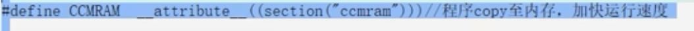
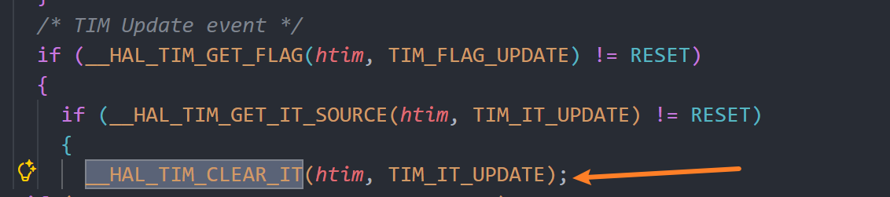
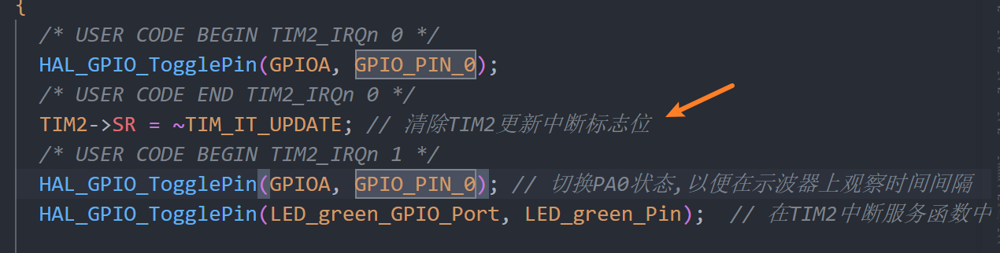
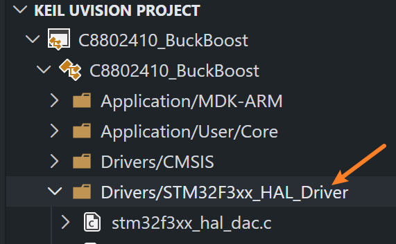
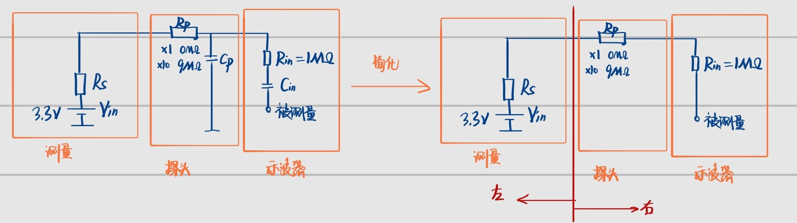

# 8. 开发板程序框架功能应用

## 8.1 采样模块

1. 编写顺序：
   1. ADC采样处理
   2. 保护程序
   3. 正式发波，验证开环

2. 配合cubemx看代码框架
3. 梳理一下现有的硬件事件
4. CCM是干什么的，在HRTIM中断函数前加入CCMRAM可以加快运行的速度，将程序放入RAM中




**攒几个实验然后去做**

# stm32开发经验总结

1. **每次生成代码记得将中断中的耗时清中断函数屏蔽了！！**

2. 在要检测运行时间的语句前后分别加电平反转信号用来测量，通过测量方波长度来测量代码运行时间

3. HAL为了简便，将很多函数封装到一块，但是实际用到的语句很少，高频开关电源速度很快，为了减少多次判断语句，将语句中需要的寄存器操作提取出来：

   

   

4. 一种计数的方法：定时后在中断中使用`static`静态变量，从1计数，计数到n，执行操作，相当于定时乘以n。

5. 全局变量：在函数外定义的，如果在别的文件中声明一下extern这个变量，那这个变量的作用域将会跨越编译单元；全局变量具有静态生存周期。

6. # 中断配置：

   stm32是两级中断：包括**NVIC使能+中断事件使能**。

   1. **NVIC使能：当NVIC对应线路有中断信号时，会交由cpu处理，cubemx配置**

      ①nvic enable

      ②配置中断优先级（先配置中断优先级分组，抢占>响应）

      ③设置中断函数：查找标志位（有的是全局中断，包括细分的多个事件），执行中断操作并清除中断标志位

   2. **事件使能：使能那个中断事件，外设的什么事件发生时，向对应的NVIC线发送中断信号，程序手动添加。**

      在主函数中，函数形式为：`__HAL_外设_ENABLE_IT()`

   **还有以一种中断配置方式：**就是在启动函数后加`_IT` 的版本，特征：

   ①在启动前会调用 `__HAL_外设_ENABLE_IT`，不用手动开启中断事件

   ②中断事件发生后，进入 **it.c** 文件，进入对应的中断函数，执行后进入对应的回调函数

   # 中断发生

   NVIC发生中断后，进入中断处理函数，执行中断操作，清空中断标志位（一个连接到NVIC的中断线，软件层面对应一个中断函数入口）

   **第一步：**判断是那个中断发生了（如果设置了多个中断事件）常用函数：`__HAL_外设_GET_FLAG()`

   ```c
     if(__HAL_UART_GET_FLAG(&huart1, UART_FLAG_RXNE))
     {
         
     }
   ```

   **第二步：**清除中断标志位，常用函数：`__HAL_外设_CLEAN_FLAG()`

   ```c
   可以将 HAL_外设_IRQHandler替换
   ```

7. 注意：tim的内部时钟指的是时钟源来源于内部时钟总线，但是内部时钟总线可能可能来源于时钟树配置的外部晶振，这并不茅盾：TIM配置里选择"Internal Clock（内部时钟）"时，这个"内部"是相对于定时器本身而言的，意思是定时器使用芯片内部总线送过来的时钟，而不是从TIMx_ETR引脚输入的外部信号。它区分的是定时器的时钟来自总线还是来自外部引脚。


7. 驱动库在这里：

   ，对应函数声明在.c文件左侧下拉即可看到

8. 高频开关电源禁止在把控制器加到功率板上调试：断点的加入一个开关管持续导通使得LC持续充电放电，打破了电路的内在平衡，而且过流过压保护的中断也会因为断点二无法进入，失效。

9. cube_Mx把所有的中断函数都放到中断文件里面了，只include了设定了中断的外设，如果中断要使用别的外设，就要先include对应外设的头文件，不然会报错。

10.  注意ADC、UART之类的输入输出就不是简单的GPIO口了，不要在引脚选择的时候选择为简单的GPIO，选择对应的名称，比如ADC_IN。

11. ## 单片机开发思维：

    **代码层面实际在做什么**

    **1. 配置（可以由CubeMX 生成）**
    告诉硬件外设"你是谁、怎么工作"——时钟、引脚、模式、触发源等，一次性写入寄存器。

    **2. 启动/停止控制（这部分得自己写）**
    扣下扳机，让硬件开始动作，软件就不参与了，硬件自己跑，cpu不参与。

    例如： `HAL_ADC_Start_DMA`、`HAL_HRTIM_WaveformCountStart` 等

    **3. 串联逻辑（软件核心）**
    外设是"执行机构"，软件的核心价值就是**把孤立的硬件事件串成有意义的业务逻辑**：

    ```
    ADC 采到电压值
        → 软件计算误差（PID）
        → 软件写 DAC/HRTIM 比较值
    	→ 硬件输出新的 PWM 占空比
    ```

    **每个箭头两端都是硬件，中间的运算和决策是软件。**

    **4. 异常处理**
    过压、过流、通信超时——硬件检测到边界，软件决定怎么响应（关 PWM、报警、重启）。

    **5. 人机交互 / 数据上报**
    你的 `DataPrint()` 就是这层——把硬件采到的原始数据，格式化后通过 UART 送出去。

    ---

    ### 一句话总结

    > **配置** = 定义外设的个性；**启动** = 给外设发令；**软件逻辑** = 读结果、做运算、下新指令，把多个外设的输入输出串成一个闭环系统。


# 示波器

## 1. 示波器的一些概念：

1. **采样率、存储深度与触发：**

   **采样率**：每隔固定时间读一次电压值，填入Excel的一行。1kSa/s就是每1ms填一行，48MSa/s就是每约20ns填一行。

   **存储深度**：就是Excel的总行数。1K就是约1000行，1M就是约100万行。是循环缓冲，旧的覆盖新的。

   **可保存时间 = 存储深度/采样率**，所以：1000行 ÷ 1000行/秒 = 能记1秒；100万行 ÷ 10000行/秒 = 能记100秒。

   将储存深度当作excel表格，采样模块**一直**在以固定速率（采样率）读取电压值，不停写入循环缓冲区（存储深度决定大小）。触发模块一直在监视信号，当条件满足时打一个标记。打完标记后再采集一段数据，然后把标记前后的数据取出来，按照时基设定的比例画在屏幕上。画完之后整个过程重新开始，等待下一次触发。如果不设置触发，就会固定时间将表格呈现一次 。

   **单位：1Sa/s，指1s采样一次**

2. **AC/DC耦合**：AC耦合会把直流分量滤掉，只显示信号的变化部分。用于观察纹波

3. **带宽：**频率高于带宽的信号被衰减，测不准

4. **垂直分辨率（ADC位数）**：示波器接受的是不断变化的模拟电压信号，内部有ADC模块将其转化为数字量。垂直分辨率越大（位数越大），可以观测到的微小变化就越小。举例：你现在CH2设的是100V/格，屏幕大约8格，所以量程大约是±400V共800V的范围。800V ÷ 256 = 每一级约**3.1V**。也就是说，电压变化小于3.1V，ADC根本分辨不出来，全当成同一个值。

5. **阻抗（1MΩ 25pF）**：

   总的输入阻抗指的是右侧部分的总阻抗，包括探头以及示波器内部的。**（×10相当于探头阻抗变为9，与内部串联变为10，此时测量值示波器内部乘以10)**，总输入阻抗越大，被被测电路内部的压降就越小，测量越准确。

6. **奈奎斯特定理**：采样率必须至少是信号频率的2倍才能还原波形。实际使用中，要看清波形细节一般需要5～10倍的采样率。48MSa/s配16MHz带宽是合理搭配。

## 2. 一些思考

1. 波形出现问题了不要着急，去脑力劳动，先去读一下波形，看看输出的电压到底是啥，是多少，然后去推理去思考，可能是因为线接错了